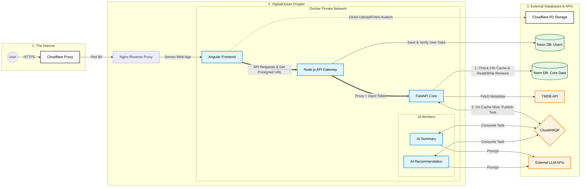

# CineMatch

Welcome to CineMatch!

> **🚀 Live Demo**: [Check out the live service here!](https://www.cinematch.dev/)

## 🌟 Overview

CineMatch is a modern movie discovery and review platform that bridges the gap between raw data and AI-driven insights. It allows users to browse movies using integrated **TMDB** data, submit detailed reviews, and interact with specialized AI services.

### Key Features
- **Smart Dashboard**: Explore categorized films (Now Playing, Popular, Upcoming, Top Rated).
- **AI Movie Recommendations**: Discover movies using natural language prompts tailored to your specific mood or interests.
- **AI Movie Review Summaries**: Get instant sentiment analysis and condensed summaries of user feedback for any film.
- **Asynchronous AI Workers**: Offload heavy LLM tasks to background workers via RabbitMQ RPC.
- **Secure Media Management**: Direct-to-storage avatar uploads using S3 presigned URLs.
- **TTL Caching**: Automated 24h caching for AI summaries to optimize LLM costs and latency.

---

## 🚀 Getting Started

### Prerequisites
- [Docker](https://docs.docker.com/get-docker/) and Docker Compose
- [Git](https://git-scm.com/)
- A **TMDB API Key** and an **LLM API Key** (NVIDIA/OpenAI)

### Local Development
1. **Clone the repository**:
   ```bash
   git clone https://github.com/sagivt1/CineMatch.git
   cd cinematch
   ```
2. **Environment Configuration**:
   Create `.env` files in `gateway/`, `core/`, `recommendation-ai/`, and `review-summary-ai/` using the provided `.env.example` templates in each folder.
   
3. **Spin up the stack**:
   ```bash
   docker compose up --build
   ```

### 🛠️ Automated Setup
CineMatch is designed for ease of use. On the first run:
- **Database Migrations**: Both User and Movie databases are automatically migrated.
- **Object Storage**: The required S3 buckets (`cinematch-avatars` and `cinematch-posters`) are automatically created and configured in MinIO.
- **Prisma Client**: The Prisma client is generated inside the Gateway container.

> **💡 Pro Tip**: For local development and full IDE support (Autocompletion/Types), it is recommended to run `npm install` and `npx prisma generate` inside the `gateway/` folder.

**Service URLs:**
- **Frontend**: http://localhost:4200
- **Gateway API**: http://localhost:3001
- **Core API**: http://localhost:8000
- **MinIO UI**: http://localhost:9001
- **RabbitMQ UI**: http://localhost:15672

### Production Deployment
For production, use the `docker-compose.prod.yml` configuration, which assumes external managed services (Neon DB, Cloudflare R2, CloudAMQP).
```bash
docker compose -f docker-compose.prod.yml up --build -d
```

> **⚠️ Production Note**: Unlike the local development environment, some production S3 providers (like Cloudflare R2) may not support automatic bucket creation or programmatic policy updates. You may need to manually create your buckets and set them to "Public" in your provider's dashboard.

---

## 🏗️ System Architecture

CineMatch is deployed on a **DigitalOcean Droplet** using Docker. It leverages a "Backend for Frontend" (BFF) pattern to maintain a clean separation between the UI and core business logic.



---

## 💻 Tech Stack

CineMatch is built with a modern, high-performance tech stack across all layers:

- **Frontend**: Angular 18+, TypeScript, Vanilla CSS, Nginx
- **API Gateway (BFF)**: Node.js, Express, Prisma ORM, JWT Authentication
- **Core Engine**: FastAPI, SQLAlchemy (Async), Pydantic, Alembic
- **AI Workers**: Python, RabbitMQ (RPC Pattern), NVIDIA/OpenAI LLM Integration
- **Infrastructure**: Neon Serverless PostgreSQL, Cloudflare R2 / MinIO, CloudAMQP
- **Deployment**: Docker & Docker Compose, Kubernetes (k8s manifests included)

---

## 🧠 AI Workflow Deep Dive

CineMatch utilizes an **Asynchronous RPC (Remote Procedure Call)** pattern via RabbitMQ to handle compute-intensive AI tasks without blocking the main API thread.

### 1. Review Summarization (Sentiment Analysis)
- **Trigger**: User navigates to a movie page.
- **Cache Check**: FastAPI checks the `review_summaries` table. If a summary exists and is less than 24 hours old, it is returned immediately.
- **Task Delegation**: On a cache miss, FastAPI aggregates local and TMDB reviews and publishes a task to the `ai.review.summary.request` queue.
- **AI Processing**: The `review-summary-ai` worker consumes the task, prompts the LLM with the aggregated text, and returns a concise summary.
- **Finalization**: FastAPI saves the new summary to the DB with a fresh timestamp and delivers it to the frontend.

### 2. Natural Language Recommendation
- **Trigger**: User enters a conversational search query.
- **Parsing**: FastAPI sends the raw prompt to the `ai.search.request` queue.
- **Intelligence**: The `AI recommendation` worker uses an LLM to "deconstruct" the user's intent into structured TMDB filters (genres, year ranges, keywords).
- **Execution**: FastAPI receives these filters, executes a discovery query against the TMDB API, and returns validated movie results.

---

## 🔐 Security Measures

CineMatch is designed with a **"Security-First"** approach to protect user data and infrastructure:

- **BFF Security Pattern**: The Node.js Gateway acts as a protective buffer. The Core API and AI Workers are isolated within a private Docker network and are never exposed directly to the public internet.
- **JWT Authentication**: Secure, stateless user sessions managed via JSON Web Tokens.
- **Presigned S3 URLs**: By using presigned URLs for avatar uploads, the system avoids handling heavy binary data directly, reducing the attack surface and server load.
- **Database Isolation**: Complete physical and logical separation between Identity (Users) and Application (Movies) data.
- **Secret Management**: Sensitive credentials (TMDB, LLM keys, Database URLs) are managed strictly through environment variables.

---

## 🛠️ Technical Reference

### Core API Endpoints
**Gateway (BFF)**
| Method | Endpoint | Description | Auth |
| :--- | :--- | :--- | :--- |
| `POST` | `/auth/register` | User registration | No |
| `POST` | `/auth/login` | JWT authentication | No |
| `PATCH` | `/auth/me` | Update user profile | Yes |
| `DELETE` | `/auth/me` | Delete user account | Yes |
| `POST` | `/auth/change-password` | Change user password | Yes |
| `GET` | `/auth/me/avatar/upload-url` | Presigned S3 URL for avatars | Yes |
| `POST` | `/auth/me/avatar/confirm` | Confirm avatar upload completion | Yes |
| `GET` | `/movies/dashboard/` | Aggregated view of trending movies | No |
| `GET` | `/movies/popular/` | List popular movies | No |
| `GET` | `/movies/now-playing/` | Movies in theaters | No |
| `GET` | `/movies/upcoming/` | Upcoming releases | No |
| GET | `/movies/top-rated/` | Top-rated movies | No |
| `GET` | `/movies/search/` | Search movies by title | No |
| `GET` | `/movies/recommendations/me/` | Personalized movie recommendations | Yes |
| `GET` | `/movies/:tmdb_id/` | Movie details & reviews | No |
| `POST` | `/movies/review/` | Submit a movie review | Yes |
| `PATCH` | `/movies/review/:review_id/` | Update an existing review | Yes |
| `GET` | `/movies/ai/:tmdb_id/summary/` | Get AI review summary | No |
| `POST` | `/movies/ai/search` | Natural language AI search | Yes |
| `GET` | `/health` | Gateway service health check | No |

**Core Service (FastAPI)**
| Method | Endpoint | Description |
| :--- | :--- | :--- |
| `GET` | `/api/movies/dashboard/` | Aggregate view of trending movie categories |
| `GET` | `/api/movies/popular/` | Paginated list of popular movies |
| `GET` | `/api/movies/now-playing/` | Movies currently in theaters |
| `GET` | `/api/movies/upcoming/` | Upcoming movie releases |
| `GET` | `/api/movies/top-rated/` | Highest-rated movies of all time |
| `GET` | `/api/movies/search/` | Search movies by title |
| `GET` | `/api/movies/recommendations/me/` | Profile-based recommendations |
| `GET` | `/api/movies/:tmdb_id/` | Detailed movie view with local & external reviews |
| `POST` | `/api/movies/review/` | Submit a new user review with rating |
| `PATCH` | `/api/movies/review/:review_id/` | Update an existing review |
| `GET` | `/api/movies/ai/:tmdb_id/summary/` | Get/Generate AI summary with 24h TTL cache |
| `POST` | `/api/movies/ai/search/` | Process natural language movie search |

> **📘 API Documentation**: When the Core service is running, you can explore the full interactive API documentation at:
> - **Swagger UI**: [http://localhost:8000/docs](http://localhost:8000/docs)
> - **ReDoc**: [http://localhost:8000/redoc](http://localhost:8000/redoc)


### Database & Migrations
- **Users DB (Prisma)**: Managed via `npx prisma migrate`. Handles identity and profiles.
- **Movies DB (Alembic)**: Managed via `alembic upgrade head`. Handles reviews and AI caches.

### Testing & Linting
- **Gateway**: `npm run lint` | `npm test`
- **Core**: `ruff check .` | `pytest`

---

## 🛠️ Troubleshooting Guide

If you encounter issues during setup or execution, check the following:

- **TMDB API Key**: Ensure your `TMDB_READ_ACCESS_TOKEN` is a valid "API Read Access Token" from your TMDB settings.
- **LLM API Key**: Ensure the `API_KEY` in `recommendation-ai/.env` and `review-summary-ai/.env` is set correctly with your NVIDIA or OpenAI key.
- **Database Migrations**: If services fail to start, check the logs for Prisma (`gateway`) or Alembic (`core`) errors. You can manually run migrations using:
  - Gateway: `npx prisma migrate deploy`
  - Core: `alembic upgrade head`
- **RabbitMQ Connectivity**: AI workers require a healthy RabbitMQ instance. Monitor the queues at `http://localhost:15672` (default: `rmq_admin`/`rmq_password`).
- **CORS Errors**: If the frontend cannot reach the API, verify the `ALLOWED_ORIGINS` in your `core/.env` and `gateway/.env`.

---

## 📂 Project Structure

- `frontend/`: Angular SPA.
- `gateway/`: Node.js BFF for auth and proxying.
- `core/`: FastAPI hub for movie logic and TMDB integration.
- `review-summary-ai/`: Worker for aggregating and summarizing sentiment.
- `recommendation-ai/`: Worker for natural language search parsing.
- `k8s/`: Kubernetes manifests for scalable deployment.

## 📄 License
This project is licensed under the MIT License - see the [LICENSE](LICENSE) file for details.
